# OpenSearch 检索流程入门与原理说明

本文梳理 Onyx 当前检索链路。当前搜索运行时使用的是 OpenSearch，不再把 Vespa 作为搜索后端；代码里仍能看到一些 `vespa` 命名或历史注释，主要是迁移期遗留的抽象名、任务名或兼容逻辑。理解检索时应以 `DocumentIndex` 抽象和 `backend/onyx/document_index/opensearch/` 实现为准。

## 0. 怎么读这份文档

这份文档按“从入口到返回”的顺序展开。可以先看流程图建立 mental model，再回到对应小节看代码位置和细节。

图里有几类节点：

- `API / UI / Chat Tool`：用户请求入口。
- `search_pipeline` / `search_chunks`：Onyx 自己的检索编排层。
- `OpenSearchDocumentIndex` / `DocumentQuery` / `OpenSearchIndexClient`：真正构造 DSL 并访问 OpenSearch 的层。
- `LLM flows`：query expansion、文档选择、上下文扩展等二次处理，不属于 OpenSearch 本身。

## 1. 先看整体

一次搜索可以来自两个主要入口：

1. `POST /api/search`
   - 代码：`backend/onyx/server/features/search/api.py`
   - 用途：程序化搜索 API，例如 CLI、Craft sandbox、集成调用。
   - 特点：运行完整的 `SearchTool.run()`，也就是和聊天内部搜索工具相同的多阶段检索流程。

2. `POST /api/search/send-search-message`
   - 代码：`backend/ee/onyx/server/query_and_chat/search_backend.py`
   - 用途：Onyx Search UI。
   - 特点：直接调用轻量版 `search_pipeline()`，可选 query expansion 和 LLM 文档选择，但不会走完整 SearchTool 的上下文扩展流程。

两条入口最终都会落到同一个底层召回主干：

```text
API / Chat Tool
  -> SearchTool.run() 或 stream_search_query()
  -> search_pipeline()
  -> search_chunks()
  -> DocumentIndex.hybrid_retrieval() / keyword_retrieval()
  -> OpenSearchDocumentIndex
  -> DocumentQuery 构造 OpenSearch DSL
  -> OpenSearchIndexClient.search()
  -> InferenceChunk
  -> 合并、RRF、LLM 选择、上下文扩展、返回 UI/LLM
```

整体可以画成：

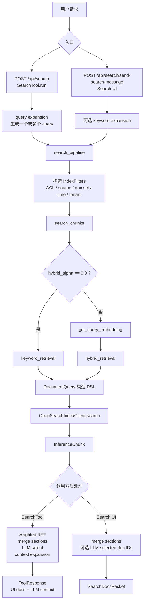

最重要的分层关系是：

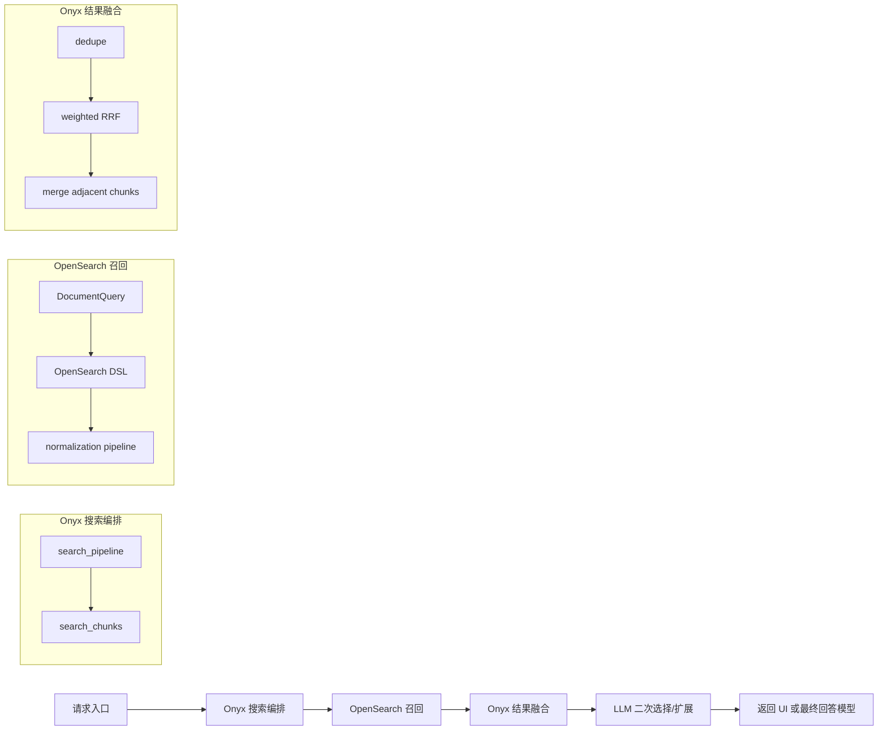

## 2. OpenSearch 是怎么被选中的

检索后端通过 `get_default_document_index()` 选择：

- 代码：`backend/onyx/document_index/factory.py`
- 关键逻辑：
  - 如果 `DISABLE_VECTOR_DB` 为真，返回 `DisabledDocumentIndex`。
  - 读取数据库里的 OpenSearch retrieval 状态：`get_opensearch_retrieval_state(db_session)`。
  - 如果 OpenSearch retrieval 已启用，返回 `OpenSearchIndexPair`。
  - 否则才会返回旧的 `VespaIndexPair`。
  - 如果 `ONYX_DISABLE_VESPA` 已设置但 OpenSearch retrieval 没有启用，会直接抛错，因为这是不一致状态。

所以现阶段排查搜索结果时，优先看：

- `backend/onyx/document_index/factory.py`
- `backend/onyx/document_index/opensearch/opensearch_document_index.py`
- `backend/onyx/document_index/opensearch/search.py`
- `backend/onyx/document_index/opensearch/schema.py`
- `backend/onyx/document_index/opensearch/client.py`

`DocumentIndex` 仍是统一接口，定义在 `backend/onyx/document_index/interfaces_new.py`，其中包含 `hybrid_retrieval`、`keyword_retrieval`、`semantic_retrieval`、`id_based_retrieval` 等能力。

选择逻辑可以简化为：

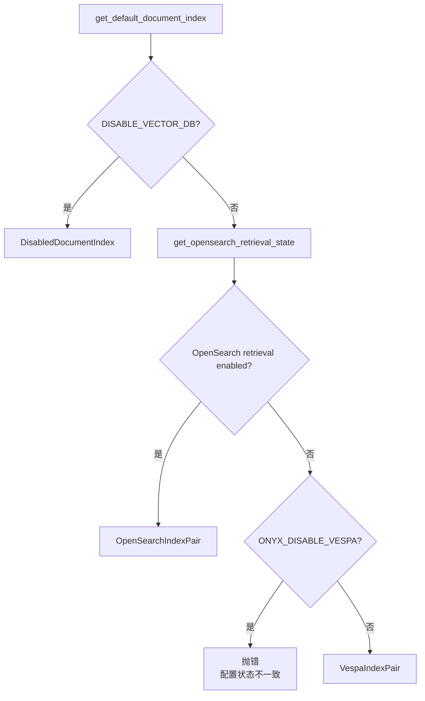

写入后端选择也类似，但看的是 `ENABLE_OPENSEARCH_INDEXING_FOR_ONYX`。所以排查“为什么搜不到”时要分开看：

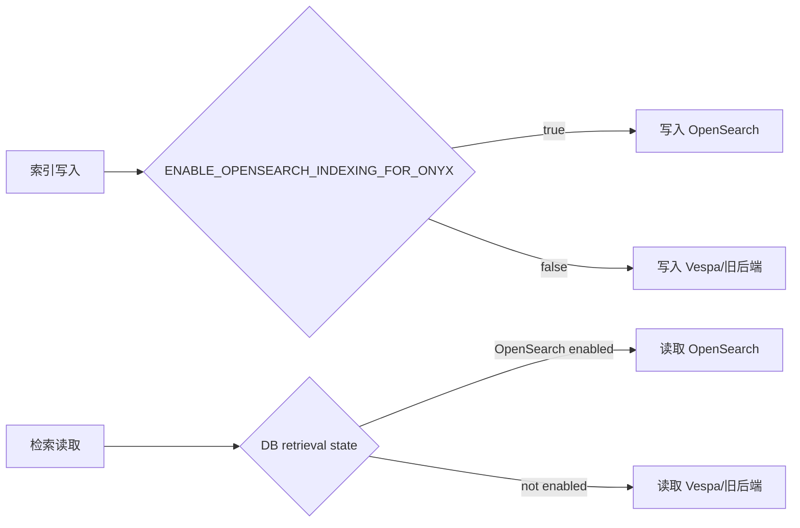

## 3. 文档在 OpenSearch 里长什么样

OpenSearch 存的不是 Onyx 业务意义上的整篇文档，而是文档 chunk。Onyx 里的一个文档会被切成多个 chunk，每个 chunk 是 OpenSearch 的一条 document。

核心模型：

- `DocumentChunkWithoutVectors`
- `DocumentChunk`
- `DocumentSchema`
- 文件：`backend/onyx/document_index/opensearch/schema.py`

主要字段：

- `document_id`：Onyx 文档 ID。
- `chunk_index`：chunk 在文档里的序号。
- `max_chunk_size`：chunk 尺寸类别，默认 512。
- `title` / `content`：全文检索字段，使用 `OPENSEARCH_TEXT_ANALYZER` 配置的 analyzer。
- `title_vector` / `content_vector`：向量检索字段，类型是 `knn_vector`。
- `source_type`：连接器来源过滤。
- `metadata_list`：标签过滤，格式来自 `convert_metadata_dict_to_list_of_strings`。
- `last_updated`：更新时间过滤，存 epoch seconds。
- `public` / `access_control_list` / `hidden`：权限和隐藏状态过滤。
- `document_sets`：文档集过滤。
- `user_projects` / `personas`：项目、助手用户文件范围过滤。
- `ancestor_hierarchy_node_ids`：助手绑定目录/空间的层级过滤。
- `tenant_id`：多租户时的租户隔离字段。

OpenSearch 文档 ID 由 `get_opensearch_doc_chunk_id()` 生成，格式包含：

```text
[tenant_prefix] + sanitized_or_hashed_document_id + "__" + max_chunk_size + "__" + chunk_index
```

这保证同一文档不同 chunk、不同 chunk size、多租户场景下不会互相覆盖。过长或非法的原始 document ID 会被过滤或 hash。

可以把 OpenSearch 里的数据模型理解成：

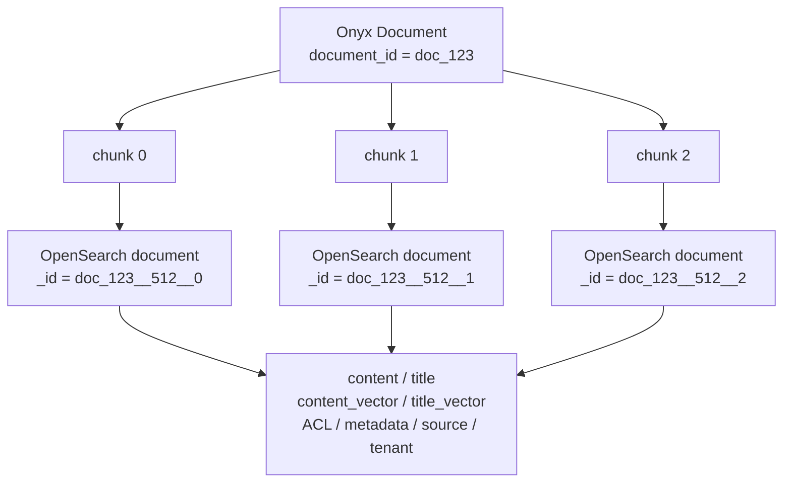

检索返回的基本单位也是 chunk。只有到了 Onyx 后处理阶段，连续 chunk 才会被合并成 `InferenceSection`。

## 4. 索引写入流程和检索的关系

检索质量依赖索引写入阶段是否正确生成了以下数据：

1. `content`
   - 代码：`_convert_onyx_chunk_to_opensearch_document()`
   - 实际写入的是 `generate_enriched_content_for_chunk_text(chunk)` 的结果，不只是原始 chunk 文本。
   - 里面可能包含 title、上下文、摘要、metadata suffix 等增强内容。

2. `content_vector`
   - 来自 indexing pipeline 生成的 full embedding。
   - OpenSearch 用 HNSW + cosine similarity 做 kNN。

3. `title_vector`
   - 如果有 title，则 title 和 title_vector 必须同时存在。
   - 当前默认 hybrid 配置不一定会用 title_vector，但 schema 支持。

4. 权限字段
   - `public` 单独存。
   - 非 public 的 ACL 存在 `access_control_list`，并且会移除 `PUBLIC_DOC_PAT`。

5. product scope 字段
   - `document_sets`
   - `user_projects`
   - `personas`
   - `ancestor_hierarchy_node_ids`

OpenSearch index 会在 `verify_and_create_index_if_necessary()` 中校验或创建。非多租户环境还会设置 OpenSearch cluster settings 和 search pipeline。

索引写入和检索字段的关系：

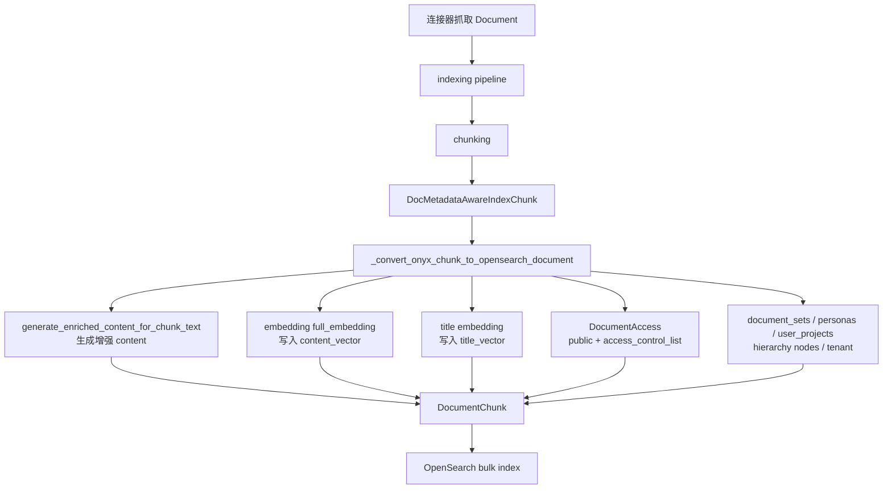

这意味着检索问题经常不是只看 query。需要同时确认：

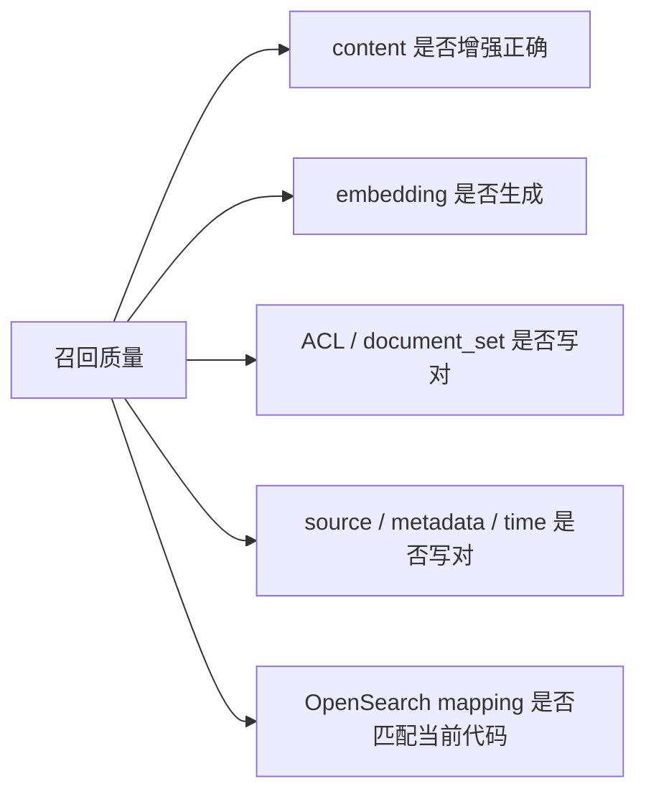

## 5. search_pipeline：统一的第一层检索管线

主函数：

- `backend/onyx/context/search/pipeline.py::search_pipeline`

它做四件事：

1. 组装最终过滤器 `IndexFilters`
   - 入口请求里的 `BaseFilters`
   - persona 的 document sets、起始时间、attached docs、hierarchy nodes
   - 用户 ACL
   - tenant_id
   - 可选的自动时间/来源识别

2. 处理 query keywords
   - `strip_stopwords(chunk_search_request.query)`
   - 结果写入 `ChunkIndexRequest.query_keywords`
   - OpenSearch hybrid 时会把这些关键词 join 后作为 `final_query`，没有关键词时回退原 query。

3. 调用 `search_chunks()`
   - 代码：`backend/onyx/context/search/retrieval/search_runner.py`

4. 做企业版 post-query censoring
   - 对 Salesforce 等字段级权限做查询后裁剪。

`_build_index_filters()` 是权限和范围过滤的关键入口。这里要注意：

- 如果用户显式传了 document set，会验证用户是否有访问权限。
- `bypass_acl=True` 时不加 ACL，只有系统调用应谨慎使用。
- 普通用户没有 bypass 时必须构造 ACL。
- persona 绑定的 attached docs / hierarchy nodes 会进入知识范围过滤。

`search_pipeline()` 内部流程：

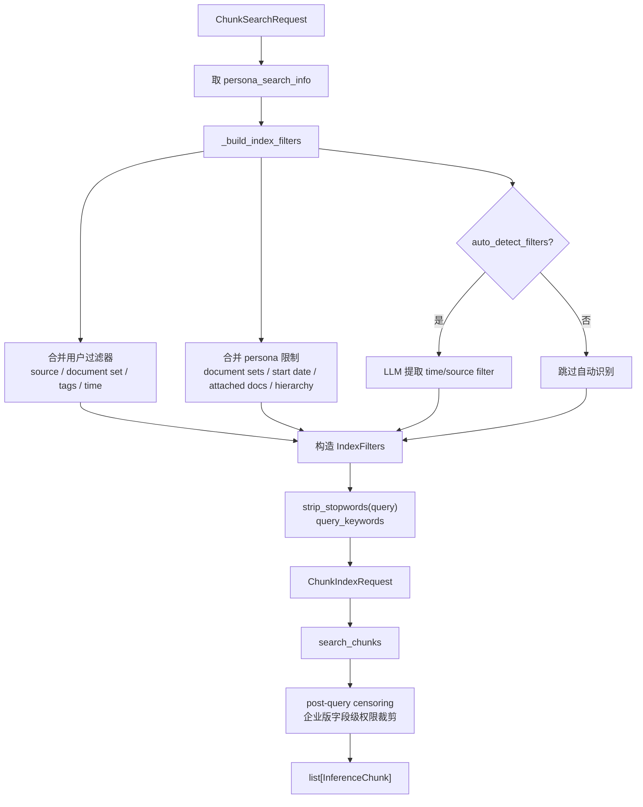

过滤器合成可以单独理解为：

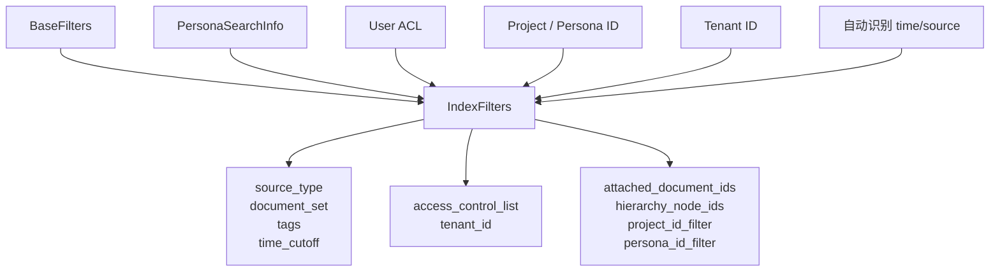

## 6. search_chunks：并行召回和基础去重

主函数：

- `backend/onyx/context/search/retrieval/search_runner.py::search_chunks`

流程：

1. 读取 federated retrieval 配置
   - 如果调用方已经 prefetch，就直接用。
   - 否则从数据库查询 `get_federated_retrieval_functions()`。

2. 判断是否还需要查 OpenSearch
   - 如果 source filter 只包含 federated source，就可以不跑普通 indexed search。
   - 否则会追加 OpenSearch 检索任务。

3. 决定 keyword-only 还是 hybrid
   - `hybrid_alpha == 0.0`：走 `document_index.keyword_retrieval()`，不计算 query embedding。
   - 其他情况：先 `get_query_embedding()`，再走 `document_index.hybrid_retrieval()`。

4. 并行执行所有检索任务
   - OpenSearch indexed search 和 federated search 可以并行。

5. 合并结果
   - `combine_retrieval_results()` 按 `(document_id, chunk_id)` 去重。
   - 如果同一个 chunk 从多个来源返回，保留 score 更高的那一个。
   - 最后按 score 降序排序。

这里的 `hybrid_alpha` 在当前 OpenSearch 路径里真正生效的是 `0.0` 这个特殊值：它会强制 keyword-only，并跳过 embedding 计算。其他值会影响 `search_runner` 里计算出的 `QueryType`，但 `OpenSearchDocumentIndex.hybrid_retrieval()` 当前没有使用 `query_type` 参数；实际 OpenSearch hybrid 权重主要由 OpenSearch search pipeline 和 `HYBRID_SEARCH_SUBQUERY_CONFIGURATION` 决定，不是简单把 `hybrid_alpha` 直接传进 OpenSearch 做线性加权。

`search_chunks()` 的分支：

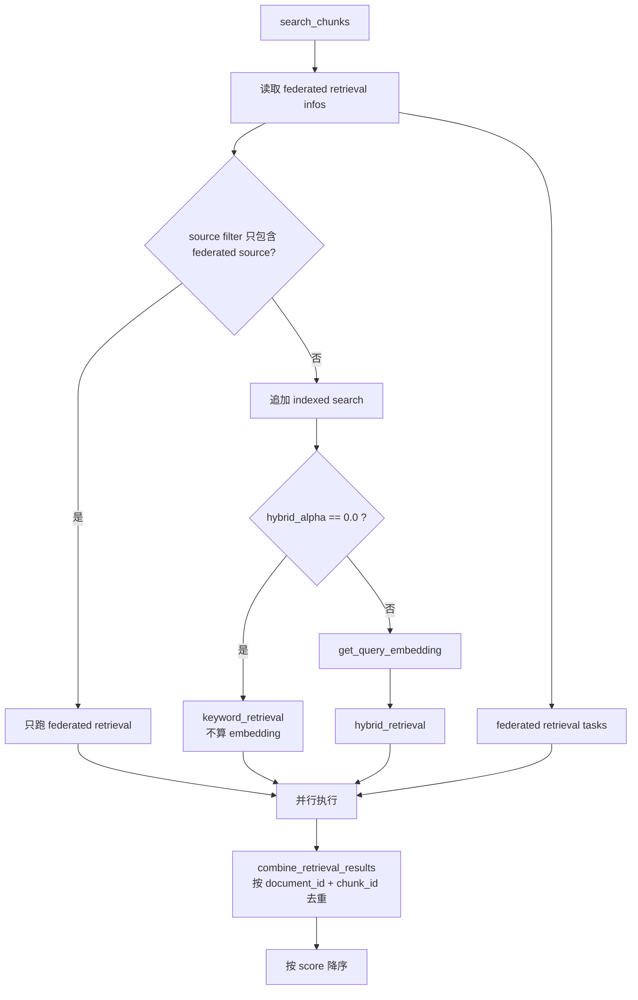

`hybrid_alpha` 的实际影响：

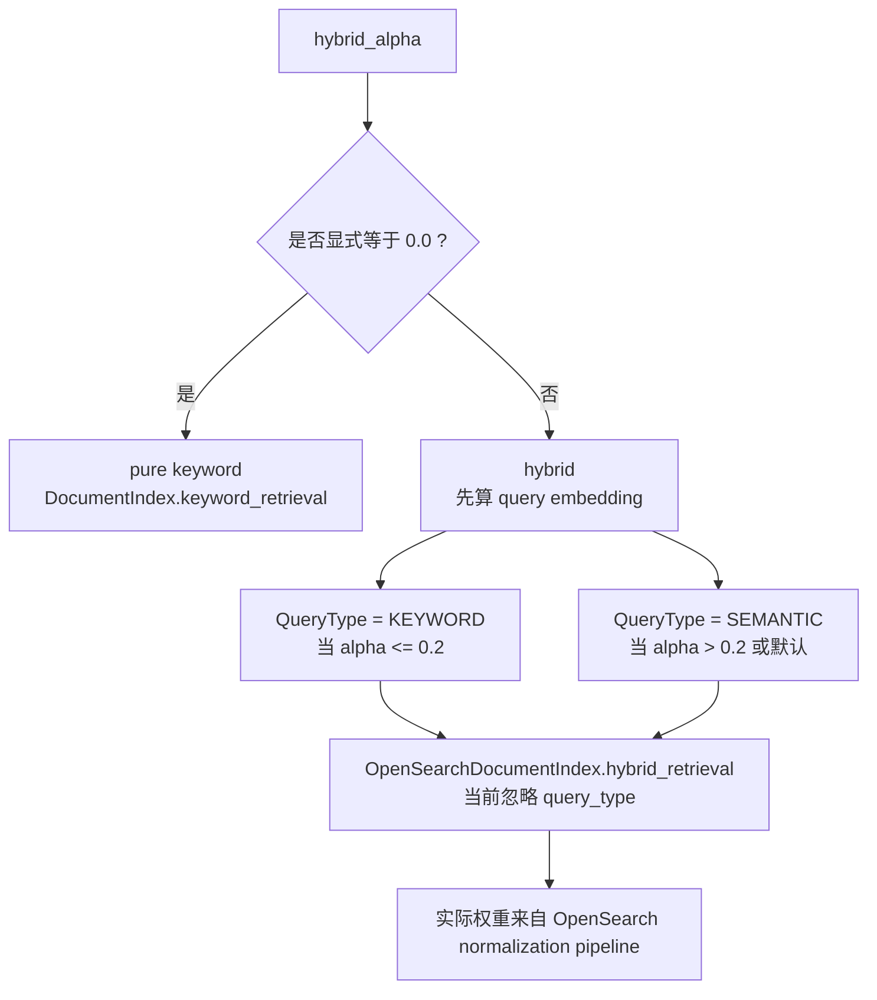

## 7. query embedding

代码：

- `backend/onyx/context/search/utils.py::get_query_embedding`
- `backend/onyx/context/search/utils.py::get_query_embeddings`

逻辑：

1. 如果调用方没有传 `EmbeddingModel`，从当前 `SearchSettings` 构造。
2. 如果启用 `QUERY_EMBEDDING_CACHE_ENABLED`，会按 query、search settings、provider、TTL 查缓存。
3. cache miss 时调用 embedding model：

```python
embedding_model.encode(queries, text_type=EmbedTextType.QUERY)
```

4. 返回的 query embedding 传入 OpenSearch kNN 查询。

如果是 pure keyword 搜索，即 `hybrid_alpha == 0.0`，不会计算 embedding。

embedding 流程：

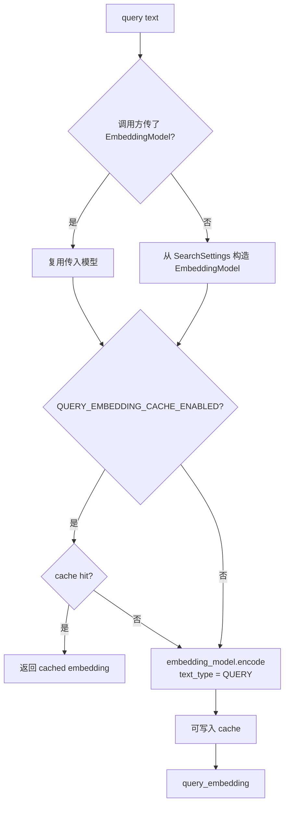

## 8. OpenSearch hybrid retrieval 细节

入口：

- `backend/onyx/document_index/opensearch/opensearch_document_index.py::OpenSearchDocumentIndex.hybrid_retrieval`

流程：

1. 计算最终 query 文本

```python
final_query = " ".join(final_keywords) if final_keywords else query
```

2. 调用 `DocumentQuery.get_hybrid_search_query()` 构造 OpenSearch DSL。
3. 取得 normalization pipeline 名称：

```python
get_normalization_pipeline_name_and_config()
```

4. 调用：

```python
self._client.search(
    body=query_body,
    search_pipeline_id=normalization_pipeline_name,
    search_type=OpenSearchSearchType.HYBRID,
)
```

5. 将 OpenSearch hit 转为 `InferenceChunkUncleaned`。
6. 调用 `cleanup_content_for_chunks()` 去掉索引时为检索增强而加入的内容，只把适合下游使用的文本暴露出来。

OpenSearch hybrid 从 Onyx 到 OpenSearch 的调用图：

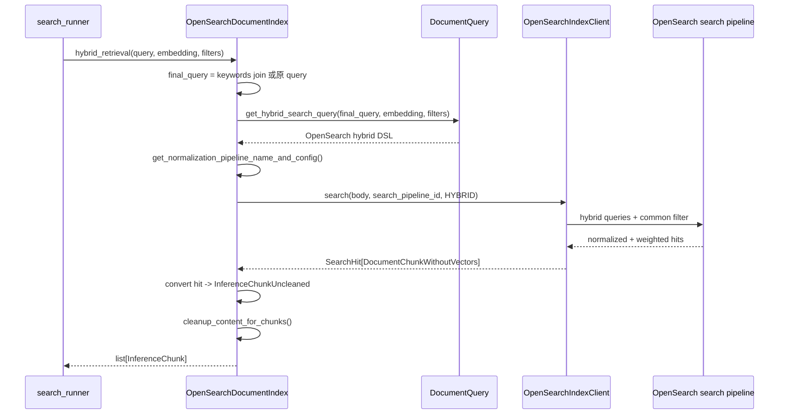

### 8.1 hybrid 查询结构

构造代码：

- `backend/onyx/document_index/opensearch/search.py::DocumentQuery.get_hybrid_search_query`
- `DocumentQuery._get_hybrid_search_subqueries`

当前默认配置：

```python
HYBRID_SEARCH_SUBQUERY_CONFIGURATION =
    CONTENT_VECTOR_TITLE_CONTENT_COMBINED_KEYWORD
```

默认会发两个子查询：

1. `content_vector` kNN
   - 字段：`content_vector`
   - 查询：`knn`
   - `k = DEFAULT_NUM_HYBRID_SUBQUERY_CANDIDATES`

2. title/content combined keyword
   - `title match`，boost 0.1
   - `title match_phrase`，slop 1，boost 0.2
   - `content match`，boost 1.0
   - `content match_phrase`，slop 1，boost 1.5
   - `minimum_should_match = 1`

也支持另一种配置：

```python
TITLE_VECTOR_CONTENT_VECTOR_TITLE_CONTENT_COMBINED_KEYWORD
```

这种会多加一个 `title_vector` kNN 子查询。

默认 hybrid DSL 结构可以理解为：

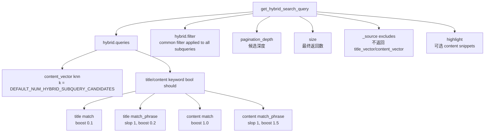

OpenSearch hybrid 内部的“先各自召回，再归一化融合”：

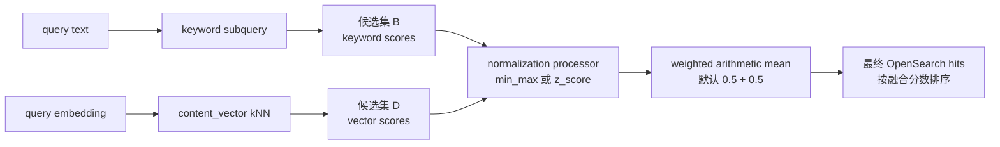

### 8.2 candidate 数量

配置：

- `DEFAULT_NUM_HYBRID_SUBQUERY_CANDIDATES`
- 默认 500
- 代码：`backend/onyx/document_index/opensearch/constants.py`

含义：

- hybrid 每个子查询先各自取更多候选，再做融合。
- 如果只取最终需要的 10 条，keyword 和 vector 候选重叠不足时很容易漏掉最终应该进入前 10 的文档。
- 候选越多召回越稳，但 OpenSearch 查询成本越高。

候选数和最终返回数不是一回事：

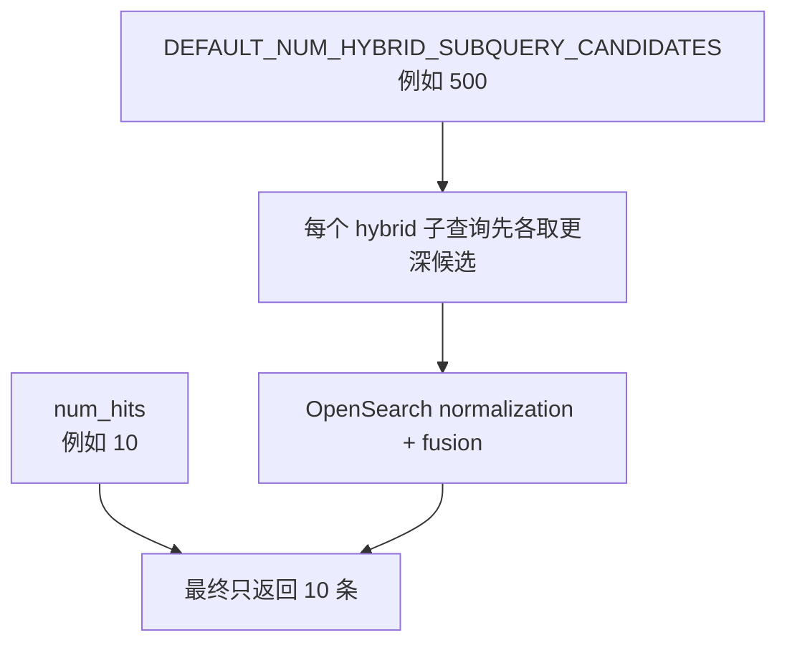

### 8.3 OpenSearch search pipeline 融合

hybrid 查询必须带 search pipeline，否则不同子查询的分数不可直接比较。

代码：

- `get_min_max_normalization_pipeline_name_and_config()`
- `get_zscore_normalization_pipeline_name_and_config()`
- `get_normalization_pipeline_name_and_config()`

默认 pipeline：

```python
HYBRID_SEARCH_NORMALIZATION_PIPELINE = MIN_MAX
```

当前默认 hybrid 子查询权重：

```text
content_vector: 0.5
keyword:        0.5
```

如果启用包含 title_vector 的三子查询配置：

```text
title_vector:   0.1
content_vector: 0.45
keyword:        0.45
```

权重顺序必须和 `_get_hybrid_search_subqueries()` 返回的子查询顺序一致。

两种 hybrid 子查询配置对比：

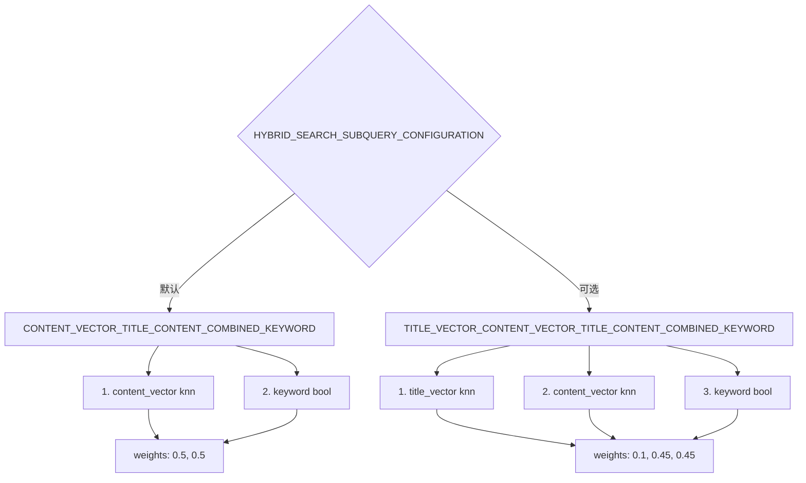

## 9. keyword retrieval 细节

入口：

- `OpenSearchDocumentIndex.keyword_retrieval`
- `DocumentQuery.get_keyword_search_query`

keyword search 不计算 embedding，也不使用 OpenSearch search pipeline。它直接构造 bool query：

- title `match`
- title `match_phrase`
- content `match`
- content `match_phrase`
- `minimum_should_match = 1`

然后附加统一 filter、highlight、timeout、source exclude。

Search UI 有一个特殊配置：

- `ONYX_SEARCH_UI_USES_OPENSEARCH_KEYWORD_SEARCH`
- 在 `send-search-message` 中，如果请求没有传 `hybrid_alpha` 且该配置开启，会把 `hybrid_alpha` 设置为 `0.0`，从而走 pure keyword。

keyword retrieval 的 DSL 结构：

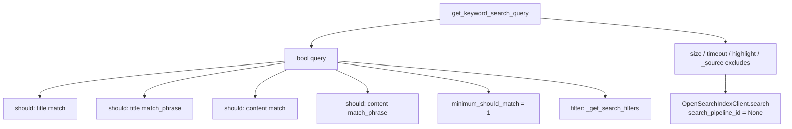

## 10. semantic retrieval 细节

入口：

- `OpenSearchDocumentIndex.semantic_retrieval`
- `DocumentQuery.get_semantic_search_query`

当前主搜索链路通常走 hybrid，而不是直接 semantic-only。但接口支持 semantic-only：

- 使用 `content_vector` kNN。
- `k = num_hits`。
- filter 会直接放入 kNN 查询的 `filter`。

semantic-only 的结构：

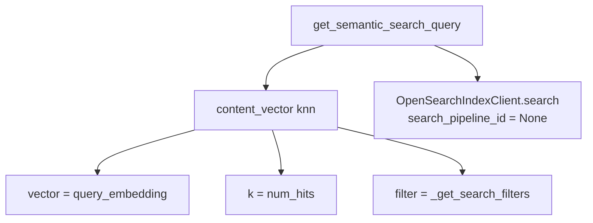

## 11. OpenSearch filter 如何工作

所有查询都会调用：

- `DocumentQuery._get_search_filters`

OpenSearch 的 filter 是 AND 关系：返回的 `filter_clauses` 中每一项都必须满足。

总过滤关系：

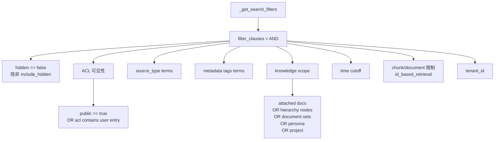

### 11.1 hidden

默认搜索会加：

```json
{"term": {"hidden": {"value": false}}}
```

admin 或特殊调用如果传 `include_hidden=True`，才会允许 hidden 文档出现。

### 11.2 ACL

如果 `access_control_list is not None`，会加入可见性 filter：

```text
public == true
OR access_control_list contains any user ACL entry
```

如果 `access_control_list` 是空列表：

- 只能看到 public 文档。

如果 `access_control_list` 是 `None`：

- 不做权限限制。
- 这只应该用于已经在上游验证过权限的内部场景，例如已选中文档后的 adjacent chunk 扩展。

ACL 三种状态的区别：

```mermaid
flowchart TD
    A[access_control_list] --> B{值是什么?}
    B -->|None| C["不加 ACL filter<br/>内部已验证场景"]
    B -->|空列表 []| D["只允许 public == true"]
    B -->|非空列表| E["public == true<br/>OR access_control_list contains any entry"]
```

### 11.3 source type

如果传了 source types：

```json
{"terms": {"source_type": [...]}}
```

### 11.4 tags

tag 会转成 metadata_list 里的字符串：

```text
tag_key + INDEX_SEPARATOR + tag_value
```

然后用 `terms` 过滤 `metadata_list`。

### 11.5 知识范围

以下任一条件存在时，会构造一个 knowledge scope filter：

- `attached_document_ids`
- `hierarchy_node_ids`
- `document_sets`
- `persona_id_filter is not None`

knowledge scope 内部是 OR：

```text
document_id in attached_document_ids
OR ancestor_hierarchy_node_ids contains hierarchy_node_ids
OR document_sets contains document_sets
OR personas contains persona_id_filter
OR user_projects contains project_id_filter
```

注意：

- `persona_id_filter` 是 primary trigger。persona 有用户文件时，它本身就能开启知识范围。
- `project_id_filter` 是 additive。它只在已有 knowledge scope 时扩大范围，不会单独限制搜索。

knowledge scope 的 OR 关系：

```mermaid
flowchart TD
    A{是否存在 knowledge scope trigger?}
    A -->|否| B["不加 knowledge scope filter<br/>搜索全部可见知识"]
    A -->|是| C["加 bool should<br/>minimum_should_match = 1"]
    C --> D["document_id in attached_document_ids"]
    C --> E["ancestor_hierarchy_node_ids in hierarchy_node_ids"]
    C --> F["document_sets contains document_set"]
    C --> G["personas contains persona_id_filter"]
    C --> H["user_projects contains project_id_filter<br/>仅在 scope 已存在时加入"]
```

### 11.6 time cutoff

如果有 `time_cutoff`：

- `last_updated >= cutoff`
- 如果 cutoff 早于默认假定文档年龄，缺少 `last_updated` 的文档也会被纳入。

默认假定文档年龄：

- `ASSUMED_DOCUMENT_AGE_DAYS = 90`

time cutoff 对缺失 `last_updated` 的处理：

```mermaid
flowchart TD
    A[time_cutoff] --> B["last_updated >= cutoff"]
    A --> C{cutoff 早于 90 天前?}
    C -->|是| D["也允许缺少 last_updated 的文档"]
    C -->|否| E["缺少 last_updated 的文档被排除"]
```

### 11.7 chunk range / document id / max chunk size

用于 `id_based_retrieval()`，也就是按文档 ID 补取某个 chunk 范围：

- `document_id`
- `chunk_index >= min_chunk_index`
- `chunk_index <= max_chunk_index`
- `max_chunk_size`

### 11.8 tenant

多租户时追加：

```json
{"term": {"tenant_id": {"value": tenant_id}}}
```

这是 OpenSearch 层面的租户隔离。

## 12. highlight

OpenSearch 查询默认会请求 content highlight，除非 `OPENSEARCH_MATCH_HIGHLIGHTS_DISABLED` 开启。

配置：

- 字段：`content`
- highlighter：`unified`
- `fragment_size = 100`
- `number_of_fragments = 4`
- `pre_tags = ["<hi>"]`
- `post_tags = ["</hi>"]`

返回后写入 `InferenceChunk.match_highlights`。这里继续使用 `<hi>` 标签，是为了兼容旧前端和旧 Vespa 返回格式，不表示当前还在用 Vespa。

## 13. OpenSearch client 返回如何变成 Onyx 对象

入口：

- `OpenSearchIndexClient.search()`
- `_convert_retrieved_opensearch_chunk_to_inference_chunk_uncleaned()`
- `cleanup_content_for_chunks()`

OpenSearch hit 会被转成：

```text
SearchHit[DocumentChunkWithoutVectors]
  -> InferenceChunkUncleaned
  -> cleanup_content_for_chunks()
  -> InferenceChunk
```

`InferenceChunk` 是后续 RRF、LLM 文档选择、引用构造和 UI 展示的核心对象。

转换时会处理：

- `score`
- `match_highlights`
- `source_links` JSON 字符串转 dict
- `metadata_list` 转 metadata dict
- `source_type` 转 `DocumentSource`
- `doc_summary`、`chunk_context` 等用于还原增强内容

向量字段默认不取回：

```json
"_source": {
  "excludes": ["title_vector", "content_vector"]
}
```

这是为了减少 OpenSearch 返回体积和网络成本。

返回对象转换流程：

```mermaid
flowchart TD
    A["OpenSearch response<br/>hits.hits"] --> B["OpenSearchIndexClient.search"]
    B --> C["SearchHit[DocumentChunkWithoutVectors]"]
    C --> D["_convert_retrieved_opensearch_chunk_to_inference_chunk_uncleaned"]
    D --> E["InferenceChunkUncleaned<br/>content 仍含增强文本"]
    E --> F[cleanup_content_for_chunks]
    F --> G["InferenceChunk<br/>下游可展示/可引用文本"]
    G --> H["merge_individual_chunks<br/>InferenceSection"]
```

## 14. SearchTool 完整流程

完整 tool search 用在：

- Chat 内部搜索工具
- `POST /api/search`

主函数：

- `backend/onyx/tools/tool_implementations/search/search_tool.py::SearchTool.run`

它比 `search_pipeline()` 多了 query expansion、RRF、LLM 选文档、上下文扩展和 LLM-facing JSON 构造。

SearchTool 完整流程图：

```mermaid
flowchart TD
    A[SearchTool.run] --> B["短 DB session 预取<br/>ACL / settings / embedding model / federated infos / Slack tokens"]
    B --> C{skip_query_expansion?}
    C -->|否| D["并行 LLM query expansion<br/>semantic_query_rephrase + keyword_query_expansion"]
    C -->|是| E[只用 tool-call query / original query]
    D --> F["组装 query + weight + hybrid_alpha"]
    E --> F
    F --> G["并行 _run_search_for_query<br/>每个 query 调 search_pipeline"]
    F --> H["可选 Slack federated search<br/>只跑 original query"]
    G --> I[weighted RRF]
    H --> I
    I --> J[merge_individual_chunks]
    J --> K["LLM select_sections_for_expansion"]
    K --> L["并行 expand_section_with_context"]
    L --> M[merge_overlapping_sections]
    M --> N["convert_inference_sections_to_llm_string"]
    N --> O["ToolResponse<br/>rich_response + llm_facing_response"]
```

### 14.1 预取 DB 数据

`SearchTool.run()` 开始时会短暂打开 DB session，预取：

- ACL filters
- SearchSettings
- EmbeddingModel
- federated retrieval functions
- Slack token / entity config

然后关闭 session。后续并行检索只用纯 Python 对象，避免多个线程共享或长期持有 DB connection。

### 14.2 Query expansion

如果没有 `skip_query_expansion`，并行调用：

- `semantic_query_rephrase()`
- `keyword_query_expansion()`

代码：

- `backend/onyx/secondary_llm_flows/query_expansion.py`

semantic query：

- 用聊天历史、用户信息、记忆，把最后一条用户消息改写成适合语义/混合检索的独立查询。

keyword queries：

- 生成最多若干条偏关键词的查询。
- 用于覆盖短查询、专有名词、模型不熟悉术语等场景。

Query expansion 输出如何进入检索：

```mermaid
flowchart TD
    A[message history + user info + memory] --> B[semantic_query_rephrase]
    A --> C[keyword_query_expansion]
    D[LLM tool-call queries] --> F[query pool]
    E[original query] --> F
    B --> F
    C --> F
    F --> G[deduplicate_queries]
    G --> H["semantic/default hybrid queries<br/>hybrid_alpha = None"]
    G --> I["keyword expansion queries<br/>hybrid_alpha = 0.2"]
    H --> J[parallel search_pipeline]
    I --> J
```

### 14.3 查询权重

代码：

- `backend/onyx/tools/tool_implementations/search/constants.py`

默认权重：

```text
LLM semantic query: 1.3
keyword expansion: 1.0
LLM tool-call query: 0.7
original query:      0.5
```

keyword expansion 查询会使用：

```python
KEYWORD_QUERY_HYBRID_ALPHA = 0.2
```

这会让 `search_runner` 选择 `QueryType.KEYWORD`，但当前 OpenSearch 实现忽略 `query_type`，所以它不会改变 OpenSearch hybrid DSL 或融合权重。如果是 `0.0`，才会真正走 pure keyword、不算 embedding。

SearchTool 多 query 权重融合：

```mermaid
flowchart LR
    A["semantic query<br/>weight 1.3"] --> E[weighted RRF]
    B["keyword expansions<br/>weight 1.0"] --> E
    C["tool-call queries<br/>weight 0.7"] --> E
    D["original query<br/>weight 0.5"] --> E
    E --> F["rank by sum(weight / (k + rank))<br/>k = 50"]
```

### 14.4 并行搜索

每个 query 都调用 `_run_search_for_query()`，内部还是 `search_pipeline()`。

同时，如果 Slack federated search 可用，会额外以原始 query 跑一次 Slack 搜索。Slack 不会随着每个 expanded query 重复查询，避免 query multiplication。

### 14.5 weighted RRF 融合

代码：

- `backend/onyx/tools/tool_implementations/search/search_utils.py::weighted_reciprocal_rank_fusion`

公式：

```text
RRF_score(item) = sum(weight / (k + rank))
```

默认：

```text
k = 50
```

作用：

- 不直接比较 OpenSearch 原始 score，因为不同 query 的归一化分数不适合跨 query 绝对比较。
- 按排名位置融合多次查询结果。
- 同一 `(document_id, chunk_id)` 可从多个查询累积分数。

RRF 和 OpenSearch normalization 的关系：

```mermaid
flowchart TD
    A["单个 query 内部"] --> B["OpenSearch hybrid normalization<br/>融合 keyword/vector 子查询"]
    B --> C["该 query 的 ranked chunks"]
    D["多个 query 之间"] --> E["Onyx weighted RRF<br/>融合多条 query 的 ranked chunks"]
    E --> F["SearchTool / Search UI 的最终 chunk 排名"]
```

### 14.6 chunk 合并为 section

代码：

- `backend/onyx/context/search/pipeline.py::merge_individual_chunks`

逻辑：

- 同一文档、chunk_id 连续的 chunk 会合并成 `InferenceSection`。
- section 的 `center_chunk` 取原始排名里最靠前的 chunk。
- 输出仍保持原始搜索排序中最早出现 section 的顺序。

这一步让下游 LLM 看到更连续的上下文，而不是碎片化 chunk。

chunk 合并示意：

```mermaid
flowchart LR
    A["doc A chunk 3"] --> B["doc A chunk 4"]
    B --> C["doc A chunk 5"]
    C --> D["InferenceSection<br/>chunks 3-5<br/>center = 原排名最高 chunk"]
    E["doc B chunk 2"] --> F["单 chunk section"]
```

### 14.7 LLM 文档选择

代码：

- `backend/onyx/secondary_llm_flows/document_filter.py::select_sections_for_expansion`

流程：

1. 先按 token budget 截断进入 selection 的 sections。
2. 每个 section 最多选 `MAX_CHUNKS_FOR_RELEVANCE = 3` 个 chunk 放入 prompt。
3. LLM 从候选 sections 中选择最值得继续展开的 section。
4. 选择结果用于：
   - UI 展示最终文档。
   - 后续上下文扩展。

LLM 文档选择阶段：

```mermaid
flowchart TD
    A[top_sections] --> B["按 token budget 截断"]
    B --> C["每个 section 最多取 MAX_CHUNKS_FOR_RELEVANCE 个 chunk"]
    C --> D["select_sections_for_expansion LLM flow"]
    D --> E[selected_sections]
    D --> F[best_doc_ids]
    E --> G[UI displayed docs]
    E --> H[context expansion 输入]
```

### 14.8 上下文扩展

代码：

- `backend/onyx/tools/tool_implementations/search/search_utils.py::expand_section_with_context`

流程：

1. 对每个选中的 section，用 `id_based_retrieval()` 取上下各 2 个 chunk。
2. LLM 分类：
   - `NOT_RELEVANT`
   - `MAIN_SECTION_ONLY`
   - `INCLUDE_ADJACENT_SECTIONS`
   - `FULL_DOCUMENT`
3. 如果需要完整上下文，再取上下各 `FULL_DOC_NUM_CHUNKS_AROUND = 5` 个 chunk。
4. 合并相邻或重叠 section，减少重复内容。

这里的 `id_based_retrieval()` 也走 OpenSearch：

- `OpenSearchDocumentIndex.id_based_retrieval`
- `DocumentQuery.get_from_document_id_query`

补取上下文时通常使用 `IndexFilters(access_control_list=None)`，因为主检索阶段已经验证过用户能看到这个文档。这个假设只适用于内部扩展，不应直接暴露给外部请求。

上下文扩展流程：

```mermaid
flowchart TD
    A[selected section] --> B["id_based_retrieval<br/>取上下各 2 个 chunk"]
    B --> C["classify_section_relevance LLM flow"]
    C --> D{分类结果}
    D -->|NOT_RELEVANT| E[可放弃或保留原 section]
    D -->|MAIN_SECTION_ONLY| F[只保留主 section]
    D -->|INCLUDE_ADJACENT_SECTIONS| G[主 section + adjacent chunks]
    D -->|FULL_DOCUMENT| H["再取上下各 FULL_DOC_NUM_CHUNKS_AROUND 个 chunk"]
    G --> I[expanded section]
    H --> I
    F --> I
    I --> J[merge_overlapping_sections]
```

### 14.9 返回给 UI 和 LLM

SearchTool 返回 `ToolResponse`：

- `rich_response`
  - `SearchDocsResponse`
  - 包含 UI 可以展示的 docs、citation mapping、displayed docs。

- `llm_facing_response`
  - JSON string。
  - 由 `convert_inference_sections_to_llm_string()` 生成。
  - 更偏向少量、高质量、带 citation 的上下文，供 LLM 最终回答使用。

## 15. Search UI 轻量流程

入口：

- `backend/ee/onyx/server/query_and_chat/search_backend.py`
- `backend/ee/onyx/search/process_search_query.py`

流程：

```text
handle_send_search_message()
  -> stream_search_query()
  -> get_default_document_index()
  -> 可选 expand_keywords()
  -> _run_single_search()
  -> search_pipeline()
  -> merge_individual_chunks()
  -> 可选 select_sections_for_expansion()
  -> SearchDocsPacket / LLMSelectedDocsPacket
```

与 SearchTool 的区别：

- Search UI 可以走 pure keyword：`hybrid_alpha = 0.0`。
- query expansion 只生成 keyword expansions。
- 多查询结果也用 weighted RRF，但权重更简单：
  - original query：2.0
  - keyword expansions：1.0
- 可选 LLM selection 只返回被选中的 doc IDs。
- 不做 SearchTool 的 adjacent/full-document context expansion。

Search UI 轻量流程图：

```mermaid
flowchart TD
    A[handle_send_search_message] --> B[stream_search_query]
    B --> C[get_default_document_index]
    B --> D{run_query_expansion?}
    D -->|是| E[expand_keywords]
    D -->|否| F[original query only]
    E --> G[all_executed_queries]
    F --> G
    G --> H{是否有 keyword expansions?}
    H -->|否| I[_run_single_search]
    H -->|是| J["并行 _run_single_search<br/>original + expansions"]
    J --> K["weighted RRF<br/>original 2.0 / expansions 1.0"]
    I --> L[merge_individual_chunks]
    K --> L
    L --> M["sections 截断到 num_hits"]
    M --> N{num_docs_fed_to_llm_selection?}
    N -->|是| O["select_sections_for_expansion<br/>只输出 doc IDs"]
    N -->|否| P[跳过 LLM selection]
    O --> Q[SearchDocsPacket + LLMSelectedDocsPacket]
    P --> R[SearchDocsPacket]
```

SearchTool 和 Search UI 对比：

```mermaid
flowchart LR
    A[SearchTool] --> A1["semantic + keyword expansion"]
    A --> A2["多 query weighted RRF"]
    A --> A3["LLM 选 section"]
    A --> A4["LLM 上下文扩展"]
    A --> A5["返回 UI docs + LLM context JSON"]

    B[Search UI] --> B1["可选 keyword expansion"]
    B --> B2["多 query weighted RRF"]
    B --> B3["可选 LLM selected doc IDs"]
    B --> B4["不做上下文扩展"]
    B --> B5["返回搜索结果 packet"]
```

## 16. federated retrieval

`search_chunks()` 会把 federated retrieval 和 OpenSearch indexed retrieval 放在同一层并行执行。

关键点：

- federated sources 不一定存在于 OpenSearch index。
- 如果用户 source filter 只包含 federated sources，就不会跑普通 OpenSearch 检索。
- 如果同时包含 indexed source 和 federated source，会并行跑，再合并结果。
- Slack 在 `SearchTool.run()` 里有特殊处理：只用原始 query 跑一次，避免 expanded queries 对 Slack 造成多倍请求。

federated retrieval 分支：

```mermaid
flowchart TD
    A[search_chunks] --> B[get_federated_retrieval_functions]
    B --> C[federated tasks]
    A --> D{source_filters}
    D -->|None| E[OpenSearch indexed search enabled]
    D -->|只包含 federated sources| F[OpenSearch indexed search disabled]
    D -->|混合 indexed + federated| E
    C --> G[parallel execution]
    E --> G
    F --> G
    G --> H[combine_retrieval_results]
```

## 17. 当前仍出现 Vespa 字样的地方怎么理解

当前代码里还有一些 Vespa 字样，不等于搜索还在用 Vespa：

- 迁移任务：`backend/onyx/background/celery/tasks/opensearch_migration/`
- 旧 worker/task 命名：例如 `background/celery/tasks/vespa`
- 历史注释：一些 filter 或 user file 字段仍写着 Vespa。
- highlight 标签：`<hi>` 沿用 Vespa 格式。
- 某些工具函数名：例如 `replace_invalid_doc_id_characters` 仍从 Vespa utils 引用。

判断真实检索后端，应看 `get_default_document_index()` 返回的对象，以及运行时是否进入 `OpenSearchDocumentIndex`。

遇到 Vespa 字样时的判断方法：

```mermaid
flowchart TD
    A[看到 Vespa 字样] --> B{是否在 document_index/factory 返回路径?}
    B -->|是| C[检查运行时是否真的返回 VespaIndexPair]
    B -->|否| D{是否在 migration / legacy 注释 / 兼容函数?}
    D -->|是| E["通常不代表当前检索使用 Vespa"]
    D -->|否| F[继续看调用栈]
    C --> G{OpenSearch retrieval state enabled?}
    G -->|是| H[真实检索应走 OpenSearchDocumentIndex]
    G -->|否| I[可能仍在旧 Vespa retrieval]
```

## 18. 调试一次搜索时看哪里

### 18.1 确认 OpenSearch 是否被用于检索

看：

- `backend/onyx/document_index/factory.py::get_default_document_index`
- 数据库中的 OpenSearch retrieval state
- 配置：`ONYX_DISABLE_VESPA`

也可以在日志里搜索：

```text
[OpenSearchDocumentIndex] Hybrid retrieving
[OpenSearchDocumentIndex] Keyword retrieving
[OpenSearchDocumentIndex] Semantic retrieving
```

### 18.2 看 OpenSearch 查询体

重点文件：

- `backend/onyx/document_index/opensearch/search.py`
- `backend/onyx/document_index/opensearch/client.py`

可以临时打开：

- `OPENSEARCH_EXPLAIN_ENABLED`
- `OPENSEARCH_PROFILING_DISABLED=False`
- `OPENSEARCH_MATCH_HIGHLIGHTS_DISABLED=False`

注意：

- explain 会显著增加延迟。
- hybrid 查询不支持 profiling，代码里也明确不在 hybrid body 上加 profile。

### 18.3 看 search tool 每个阶段耗时

`SearchTool.run()` 会记录：

- query expansion 耗时
- document selection 耗时
- document expansion 耗时
- total execution time

### 18.4 看 OpenSearch 指标

`OpenSearchIndexClient.search()` 会打 metrics：

- `observe_opensearch_search`
- `record_opensearch_search_error`
- `track_opensearch_search`

指标代码：

- `backend/onyx/server/metrics/opensearch_search.py`

### 18.5 常见无结果原因

1. ACL 太窄
   - 检查 `build_access_filters_for_user()` 和 OpenSearch 的 ACL 字段。

2. document set / persona / hierarchy 过滤过窄
   - 检查 `_build_index_filters()` 和 `_get_search_filters()`。

3. hidden 文档
   - 普通搜索默认过滤 `hidden=False`。

4. source filter 排除了 indexed source
   - 如果 source filter 只剩 federated source，就不会查 OpenSearch。

5. time cutoff 排除了文档
   - 注意缺失 `last_updated` 的文档只在 cutoff 足够老时会被纳入。

6. OpenSearch retrieval state 没启用
   - `get_default_document_index()` 可能没有返回 OpenSearch。

7. query expansion 质量差
   - SearchTool 可用 `skip_query_expansion` 对比原始 query 效果。

8. candidate 数量不够
   - 调整 `DEFAULT_NUM_HYBRID_SUBQUERY_CANDIDATES` 会影响召回和延迟。

无结果排查树：

```mermaid
flowchart TD
    A[搜索无结果] --> B{是否进入 OpenSearchDocumentIndex?}
    B -->|否| C["检查 get_default_document_index<br/>retrieval state / ONYX_DISABLE_VESPA"]
    B -->|是| D{OpenSearch 查询是否有 hits?}
    D -->|否| E["检查 OpenSearch DSL<br/>query / filters / index data"]
    D -->|是| F{Onyx 后处理后是否被裁掉?}
    F -->|是| G["检查 post-query censoring<br/>LLM selection / section truncation"]
    F -->|否| H[检查前端展示或 API packet]

    E --> I{filter 是否过窄?}
    I -->|ACL| J[检查 access_control_list / public]
    I -->|scope| K[检查 document_set / persona / hierarchy / project]
    I -->|time/source/tags| L[检查对应字段和请求过滤器]
    I -->|query| M[对比 keyword-only / hybrid / skip expansion]
```

结果质量差排查树：

```mermaid
flowchart TD
    A[结果质量差] --> B{召回阶段问题还是后处理问题?}
    B --> C[单 query OpenSearch hits 不准]
    B --> D[多 query 融合后变差]
    B --> E[LLM 选择/扩展后变差]

    C --> C1["检查 content 增强<br/>chunk_context / doc_summary / metadata_suffix"]
    C --> C2["检查 embedding 模型和 query embedding"]
    C --> C3["检查 keyword analyzer / boosts / phrase slop"]
    C --> C4["检查 hybrid normalization weights"]

    D --> D1["检查 query expansion 输出"]
    D --> D2["检查 RRF weights"]
    D --> D3["检查 duplicate chunk 的 document_id/chunk_id"]

    E --> E1["检查 select_sections_for_expansion prompt/result"]
    E --> E2["检查上下文扩展分类"]
    E --> E3["检查 token budget 截断"]
```

延迟排查树：

```mermaid
flowchart TD
    A[搜索延迟高] --> B{慢在哪一层?}
    B --> C[OpenSearch]
    B --> D[Embedding]
    B --> E[Query expansion / LLM selection]
    B --> F[Federated retrieval]

    C --> C1["看 opensearch_search metrics<br/>client/server/overhead"]
    C --> C2["检查 DEFAULT_NUM_HYBRID_SUBQUERY_CANDIDATES"]
    C --> C3["检查 filters 大小和 source/doc set 范围"]
    C --> C4["确认 explain/profile 未误开"]

    D --> D1[检查 embedding cache]
    D --> D2[检查 model server 延迟]

    E --> E1["看 SearchTool timing logs"]
    E --> E2["临时 skip_query_expansion 或关闭 LLM selection 对比"]

    F --> F1["分离 federated source filter 测试"]
```

## 19. 修改检索行为时的常见位置

改动位置总览：

```mermaid
flowchart TD
    A[想修改检索行为] --> B{改哪一层?}
    B --> C[索引字段/schema]
    B --> D[OpenSearch 召回 DSL]
    B --> E[权限和过滤]
    B --> F[query expansion]
    B --> G[多 query 融合]
    B --> H[LLM 选择/上下文扩展]

    C --> C1["opensearch/schema.py<br/>opensearch_document_index.py"]
    D --> D1["opensearch/search.py<br/>opensearch/constants.py"]
    E --> E1["context/search/pipeline.py<br/>opensearch/search.py<br/>access_filters.py"]
    F --> F1["secondary_llm_flows/query_expansion.py"]
    G --> G1["search/constants.py<br/>process_search_query.py"]
    H --> H1["document_filter.py<br/>search_utils.py"]
```

### 改 OpenSearch schema

- `backend/onyx/document_index/opensearch/schema.py`

注意：

- `DocumentSchema.get_document_schema()` 和 `DocumentChunk` 模型必须同步。
- 已存在字段不能随意改类型，OpenSearch mapping 不支持直接变更字段类型，通常需要重建索引。

### 改 hybrid 子查询

- `backend/onyx/document_index/opensearch/search.py::_get_hybrid_search_subqueries`
- `backend/onyx/document_index/opensearch/constants.py`

注意：

- 子查询顺序必须和 normalization pipeline weights 顺序一致。
- OpenSearch hybrid 查询最多 5 个 query clauses。

### 改 keyword 匹配

- `DocumentQuery._get_title_content_combined_keyword_search_query`

可调：

- title/content boost
- `match` vs `match_phrase`
- `slop`
- `minimum_should_match`
- analyzer 配置 `OPENSEARCH_TEXT_ANALYZER`

### 改过滤权限

- `backend/onyx/context/search/pipeline.py::_build_index_filters`
- `backend/onyx/document_index/opensearch/search.py::_get_search_filters`
- `backend/onyx/context/search/preprocessing/access_filters.py`

注意：

- 新过滤字段需要同时支持索引写入、schema、query 构建。
- 权限相关修改要优先保证默认安全，不要让 `access_control_list=None` 泄露到外部可控路径。

### 改 query expansion

- `backend/onyx/secondary_llm_flows/query_expansion.py`
- `backend/ee/onyx/secondary_llm_flows/query_expansion.py`

注意：

- 所有 LLM 调用必须带 `LLMFlow` tracing。
- SearchTool 和 Search UI 用的是不同 query expansion 流程。

### 改 RRF 权重

- SearchTool：`backend/onyx/tools/tool_implementations/search/constants.py`
- Search UI：`backend/ee/onyx/search/process_search_query.py`

### 改上下文扩展

- `backend/onyx/tools/tool_implementations/search/search_utils.py`
- `backend/onyx/secondary_llm_flows/document_filter.py`

可调：

- `MAX_CHUNKS_FOR_RELEVANCE`
- `FULL_DOC_NUM_CHUNKS_AROUND`
- context expansion prompt
- section selection prompt

## 20. 关键代码索引

入口：

- `backend/onyx/server/features/search/api.py`
- `backend/ee/onyx/server/query_and_chat/search_backend.py`
- `backend/ee/onyx/search/process_search_query.py`
- `backend/onyx/tools/tool_implementations/search/search_tool.py`

统一搜索管线：

- `backend/onyx/context/search/pipeline.py`
- `backend/onyx/context/search/retrieval/search_runner.py`
- `backend/onyx/context/search/models.py`
- `backend/onyx/context/search/utils.py`

OpenSearch 实现：

- `backend/onyx/document_index/factory.py`
- `backend/onyx/document_index/interfaces_new.py`
- `backend/onyx/document_index/opensearch/opensearch_document_index.py`
- `backend/onyx/document_index/opensearch/search.py`
- `backend/onyx/document_index/opensearch/schema.py`
- `backend/onyx/document_index/opensearch/client.py`
- `backend/onyx/document_index/opensearch/constants.py`

LLM 后处理：

- `backend/onyx/secondary_llm_flows/query_expansion.py`
- `backend/ee/onyx/secondary_llm_flows/query_expansion.py`
- `backend/onyx/secondary_llm_flows/document_filter.py`
- `backend/onyx/tools/tool_implementations/search/search_utils.py`
- `backend/onyx/tools/tool_implementations/search/constants.py`

权限和过滤：

- `backend/onyx/context/search/preprocessing/access_filters.py`
- `backend/onyx/db/document_set.py`
- `backend/ee/onyx/external_permissions/post_query_censoring.py`

迁移相关：

- `backend/onyx/db/opensearch_migration.py`
- `backend/onyx/background/celery/tasks/opensearch_migration/`

## 21. 一句话 mental model

当前检索可以理解为：

```text
先由 API / Chat Tool 生成一个或多个搜索 query；
每个 query 经 search_pipeline 组装权限和范围过滤；
OpenSearch 用 content_vector kNN 与 title/content keyword 子查询做 hybrid 召回；
OpenSearch search pipeline 归一化并融合子查询分数；
Onyx 再对多 query 结果做 weighted RRF；
相邻 chunk 合并成 section；
必要时由 LLM 选择最相关 section 并补取上下文；
最后返回 UI 文档列表和 LLM 可引用的上下文 JSON。
```
